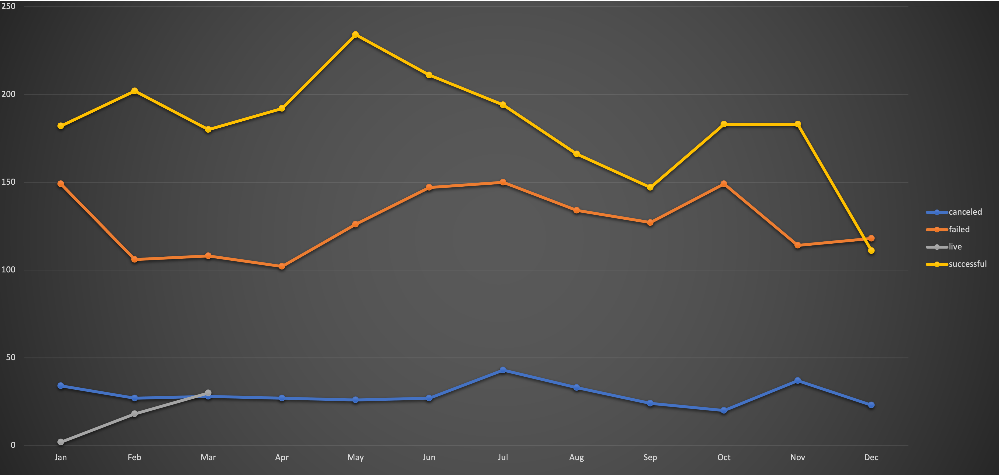
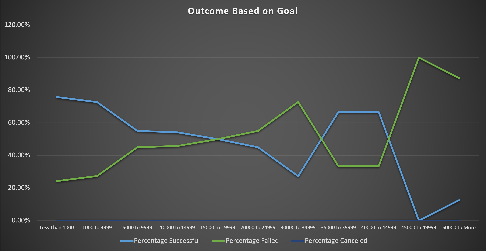

# Kickstarting with Excel 

## Overview of Project 
 
### Purpose
   I am performing Analysis on Kickstarter Data for Theater/plays to uncover trends based on their funding goal amounts and launched dates so that louise can have an idea of how her kickstarter play *Fever* will fair. 

## Analysis and Challenges
  I analyzed the data in a few different ways. One was by looking at outcomes based on their launch date. The other was lookoing at their outcomes based on their funding goals for louise specific Parent Category and Subcategory.

### Analysis of Outcomes Based on Launch Dates
  I started this analysis by converting the starting date and end date data in the kickstarter Data from Unix timestamps to day-month-year format that we can interpret. I accomplished that by using the below formula to convert then tranfer the readable date to fresh new columns.
  
  ```
  =(((J2/60)/60)/24)+DATE(1970,1,1)
  ```
  
From that point I created a pivot table in a new sheet called Theater Outcomes by Launch Date. I made this pivot table by filtering by parent category and years, making the Columns value to be "outcome," Rows value to be "Date Created Conversion," and Values to be "outcome.". That table then allowed me to filter the data by the Theater Parent Category to show how many kickstartes were successful, failed, and canceled in each month. It also let me see how many kickstarters we started in total in each month. From that table I was able to also create the below chart that I can filter by parent category as well as years using the table. This allows us to visualize how successful Theater kickstarters are depending on what month of the year they were started.



### Analysis of Outcomes Based on Goals
  I started the analysis of how play kickstarters are effected based on their funding goals by setting ranges of goals for the Kickstarters. Starting with less than a thousand then grouping them in $5,000 incremnts until we end with $50,000 or more for funding goals. From there I used the following COUNTIFS function to pull the number of succeful play kickstarters from the Kickstarter Data sheet for the less than a 1000 funding goal range. 
 
 ```
  =COUNTIFS(kickstarter!$F:$F,"=successful",kickstarter!$D:$D,"<1000",kickstarter!$R:$R,"=plays")
  ```
  
By subbing out the "=successful" with cancelled and failed I could pull the count for those columns as well. Then by running the below COUNTIFS function I could pull the number of succeful play kickstarters from the Kickstarter Data sheet for the $1,000 to $4,999 range.

```
=COUNTIFS(kickstarter!$F:$F,"=successful",kickstarter!$D:$D,">999",kickstarter!$R:$R,"=plays",kickstarter!$D:$D,"<5000")
```

Then I subbed "=successful" with cancelled and failed so I could pull the count for those columns again. Next we would sub in the next range of funding goals until the table was complete. Next I used the Sum() function to add up all of the successful, failed, and canceled kickstarters to get the total number of projects for each range of goals. With that column filled we were able to find the percentage of successful, failed, and canceled play kickstarters for each range of goals by dividing succeful, failed, and canceled by the total. We then used that to create the below chart to give louise a visual look at what we found using Pivot Charts.



### Challenges and Difficulties Encountered
  The biggest problem I ecnountered during this analysis was an error in the second COUNTIFS function with ranges. I could not get a number to populate at first due to using multiple <>= signs. Once i simplified the code to using one of each for each for the two paramters I was able to get the correct totals to populate.
  
## Results
  From all of the data I've gatherd and analyzed here we can come away with a few conclusions we make when it comes to play kickstarters. Looking at the outcomes based on launch date data the first conclusion we can make is that it is clear that if you start your play project any where from April to August you have a very high chance of your kickstarter succeeding. With your greatest chance of having a play kickster be successful by starting it in May. The second conclusion we can draw from this data is that your chances of having a successful play kickstaer plummet the closer you get to the end of the year. From September to December hold some of the fewest number of succssful campaigns as well as some of the highest number of failed campaigns. With the lowest number of succesful campaigns coming in December.
  When it comes to lokking at Outcomes based on funding goals we can concluded that from $0 to $19,999 you have a higehr chance of your kickstarter succeeding than it failing. However the gap does close the closer you get to that $15,000-$19,999 funding goal point. Then from $19,999 to the $34,999 goal point your kickstarter has a better chance at failing than succeeding. Then from $35,00 to $44,999 Goal point it flips and your kickstarter has a better chance at suceeding than failing. From that point on if your goal is $50,000 or more your kickstarter has a slim chance of succeeding with a 100% fail rate in the $45,00 to $49,999 funding goal. After understanding how these gaps interact with the success of a play Kickstarter it would be best to have a funding goal between $0 to $14,999. Or from $35,000 to $44,999 where you have 2/3 chance of your kickstarter being successful. Anyother funding goals would be a risky bet at best.
With that being said this data does have some limitations. With the outcomes based on launch date we do not factor in the closing date. I believe that would tell us more about how the length of the campaign effects succes which I think could be very useful data. That would alos be a graph we could add that woudl help Louise understand how time affects kickstarters success.


